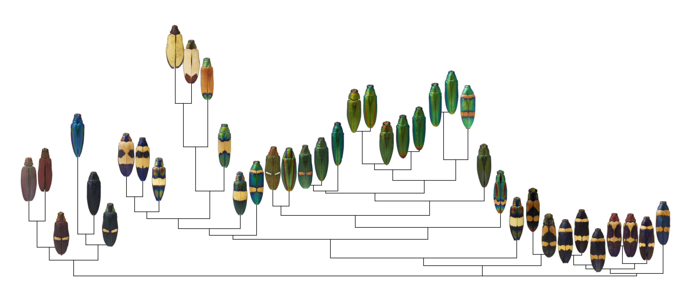

## What I'm working on these days
  
   

### Pivoting to a postdoc!

I defended my PhD dissertation in April 2023, and am taking a slow summer to move, reset, and embark on my postdoctoral research. In September 2023 I am joining the Integrative Evolutionary Biology group led by Claudius Kratochwil at the University of Helsinki, Finland. Here I will study the evolution and development of color patterns in fishes, and focus especially on the interplay robustness (the persistence of a phenotype under perturbation) with evolutionary changes. So here's an important Finnish sentence for you: tämä kala on jotenkin outo!

Lab webpage [here](https://www.helsinki.fi/en/researchgroups/integrative-evolutionary-biology).

### The evolution of mouthbrooding in fishes

Right now I'm studying the evolution of mouthbrooding (a kind of parental care where parents incubate offspring in their mouths), and how much feeding phenotypes influence that evolution. I think that mouthbrooding is a beautiful example of an extraordinary behavior (using a mouth as a nursery!) that arises from co-opting existing traits. Specifically, it seems like mouthbrooding is more likely to evolve in species whose feeding adaptations already make them good at mouthbrooding. And the further I dive into the whys and hows, the more I appreciate how much this behavior seems to be the result of the interplay of morphology, behavior, and environment. I have a somewhat out-there idea for why only some fishes in a given environment will evolve mouthbrooding, and it's what I'm testing now.

More [here](/category/mouthbrooding/).

 

### Color analysis software

I also work a lot on color pattern evolution, and have written a few R packages to make that easier for myself and others. I think that accessible, objective tools for color pattern research are an important part of making sure we're being careful with the conclusions we draw about how much color matters to other living things. Current projects include:

* `recolorize`, an R package for color segmentation, which integrates with the `pavo` and `patternize` packages as well as providing a variety of other output formats (vectorized images, individual layers, masks). More [here](/category/recolorize).

* `colordistance`, an R package for comparing images by quantitative color similarity:

More [here](/category/colordistance).

### Collaborations

I'm lucky to have really delightful spread of collaborations with researchers at other universities, including:
  - UV in snakes (University of Michigan, Davis-Rabosky lab)
  - The origin and diversity of color jewel beetles (Louisiana State University, Lord lab)
  - Population structure and color variation in brook trout (Pennsylvania State University)
  - The effect of mouthbrooding on the rate of craniofacial evolution (Clemson, Price lab)

