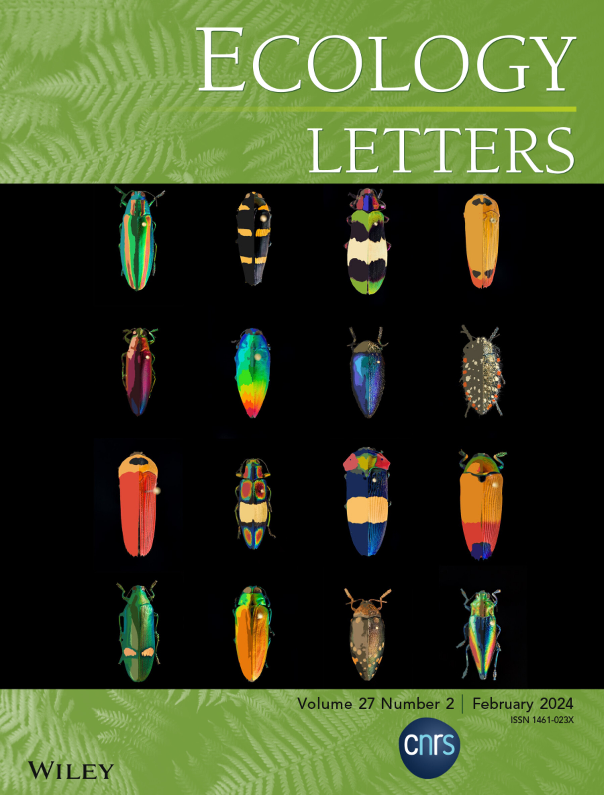

 Click here to download.

Hannah Weller
============

> **Research interests**: Evolution, development, and ecology of color patterns;
> broadly, how traits interact to shape evolutionary trajectories;
> method and software development for accessible phenotyping approaches.

----

<small>Last updated: March 5, 2025</small>

   

Present Position
---------

2023—Present
:   **Postdoctoral research fellow, Integrative Evolutionary Biology Group**  
  University of Helsinki (Helsinki, Finland)    

Education
---------

2019—2023
:   **PhD, Ecology and Evolutionary Biology**  
  Brown University (Providence, RI)    
    *Thesis: The opportunities of evolutionary constraint, with a focus on the evolution of mouthbrooding in cichlids*

2017—2019
:   **Transitional M.Sc., Ecology and Evolutionary Biology**  
  Brown University (Providence, RI)    
   *Thesis: How do feeding adaptations influence the convergent evolution of mouthbrooding?*

2012—2016
:   **Honors B.Sc., Biology**  
  University of Chicago (Chicago, IL)    
   *Thesis: Winnowing in the eartheater cichlids*  

   

Awards and Fellowships
----------------------
April 2025
: **Marie Skłodowska-Curie Postdoctoral Fellowship**  
    €226,276.80, European Commission
 
January 2022
: **Doctoral Dissertation Enhancement Grant**  
    $10,000, Bushnell Fund at Brown University
    
May 2021
: **Dean's Excellence in Teaching Award**
    Brown University, Alpert Medical School

April 2019
: **Graduate Research Fellowship**  
    $138,000, National Science Foundation

December 2018
: **Field Museum Visiting Scientist Scholarship**  
    $1,500, Field Museum of Natural History

May 2017
: **Presidential Fellowship**  
    $108,000, Brown University

June 2015
: **Jeff Metcalf Undergraduate Research Fellowship**  
    $5,000, Marine Biological Laboratory

March 2015
: **Elected to Phi Beta Kappa Society**

September 2014
: **Best Presentation, Undergraduate Research Symposium**  
    $150, University of Chicago

June 2014
: **Elliott and Eileen Hinkes Research Fellowship**  
    $4,000, University of Chicago

   

Peer-reviewed publications
--------------------------
Mayerl, C.J., Capano, J.G., Van Meer, N., **Weller, H.I.**, Kaczmarek, E.B., Chadam, M., Blob, R.W., Brainerd, E.L. and Wyneken, J. (2024). Turtle Girdles: Comparing the Relationships Between Environment and Behavior on Forelimb Function in Loggerhead Sea Turtles (*Caretta caretta*) and River Cooters (*Pseudemys concinna*). *Journal of Morphology*. DOI: [https://doi.org/10.1002/jmor.70007](https://doi.org/10.1002/jmor.70007).

Crowell, H.L.\*, Curlis, J.D.\*, **Weller, H.I.**\*, Davis Rabosky, A.R.\*  (2024). Predators drive the evolution of ultraviolet colouration in snakes. *Nature Communications*. DOI: [https://doi.org/10.1038/](https://doi.org/10.1038/).  
\*These authors contributed equally to this work.

**Weller, H.I.**, Hiller, A.E., Van Belleghem, S.M., and Lord, N.P. (2024). Recolorize: flexible color segmentation of biological images. *Ecology Letters*. DOI: [https://doi.org/10.1111/ele.14378](https://doi.org/10.1111/ele.14378).  
This article was featured on the cover of the journal: 

Paquette, S.E., Martin, N., Rodd, A., Manz, K.E., Camarillo, M., Allen, E., **Weller, H.I**, Pennell, K., and Plavicki, J (2023). Neural dysregulation and aberrant microglial responses to brain injury following perfluorooctane sulfonate exposure in larval zebrafish. *Environmental Health Perspectives.* DOI: [https://doi.org/10.1289/EHP1286](https://doi.org/10.1289/EHP1286). 

Tumulty, J.P., Miller, S.E., Van Belleghem, S.M., **Weller, H.I.**, Jernigan, C.M., Vincent, S., Staudenraus, R.J., Legan, A.W., Polnaszek, T.J., Uy, F.M.K, Walton, A., and Sheehan, M.J. (2023). Evidence for a selective link between cooperation and individual recognition. *Current Biology*. DOI: [https://doi.org/10.1016/j.cub.2023.11.032](https://doi.org/10.1016/j.cub.2023.11.032).

**Weller, H.I.**, López-Fernández, H., McMahan, C.D., and Brainerd, E.L. (2022). Relaxed feeding constraints facilitate the evolution of mouthbrooding in Neotropical cichlids. *The American Naturalist*. DOI: [https://doi.org/10.1086/719235](https://doi.org/10.1086/719235). 

Capano, J.G., Boback, S.M., **Weller, H.I.**, Cieri, R.L., Zemer, C.F., and Brainerd, E.L.  (2022). Modular lung ventilation in *Boa constrictor*. *Journal of Experimental Biology*. DOI: [https://doi.org/10.1242/jeb.243119](https://doi.org/10.1242/jeb.243119).

**Weller, H.I.**, Olsen, A., Camp, A.L., Hernandez, L.P., Manafzadeh, A.R., and Brainerd, E.L. (2020). An XROMM study of intra-oral transport and swallowing in catfish. *Integrative Organismal Biology*. DOI: [https://doi.org/10.1093/iob/obaa018](https://doi.org/10.1093/iob/obaa018).

Cohen, K.E., **Weller, H.I.**, Westneat, M.W., and Summers, A.P (2020). The Evolutionary Continuum of Functional Homodonty to Heterodonty in the Dentition of *Halichoeres* Wrasses. *Integrative and Comparative Biology*. DOI: [https://doi.org/10.1093/icb/icaa137](https://doi.org/10.1093/icb/icaa137).

**Weller, H.I.**\*, Hooper, S.E.\*, and Amelon, S.K\* (2020). Countcolors, an R package for quantification of the fluorescence emitted by *Pseudogymnoascus destructans* lesions on the wing membranes of hibernating bats. *Journal of Wildlife Diseases*. DOI: [https://doi.org/10.7589/2019-09-231](https://doi.org/10.7589/2019-09-231)  
\*These authors contributed equally to this work.

Cohen, K.E., **Weller, H.I.**, and Summers, A.P. (2020). Not your father’s homodonty—stress, tooth shape, and the functional homodont. *Journal of Anatomy*. DOI: [https://doi.org/10.1111/joa.13248](https://doi.org/10.1111/joa.13248)

van Meer, N.M., **Weller, H.I.**, Manafzadeh, A.R., Kaczmarek, E.B., Scott, B., Gussekloo, S.W.S, Wilga, C.D., Camp, A.L., and Brainerd, E.L. (2019). Intra-oropharyngeal food transport and swallowing in white-spotted bamboo sharks. *Journal of Experimental Biology*. DOI: [10.1242/jeb.201426](https://doi.org/10.1242/jeb.201426)

**Weller, H.I.**, and Westneat, M.W. (2019). Quantitative color profiling of digital images with earth mover’s distance using the R package colordistance. *PeerJ*. DOI: [10.7717/peerj.6398](https://doi.org/10.7717/peerj.6398)

**Weller, H.I.**, McMahan, C.D., and Westneat, M.W. (2017). Dirt-sifting Devilfish: Winnowing in the geophagine cichlid *Satanoperca daemon* and evolutionary implications. *Zoomorphology*. DOI: [10.1007/s00435-016-0335-6](https://doi.org/10.1007/s00435-016-0335-6)

   

Software
---------------------------

**Weller, H.I.** (2021). recolorize: Simplify and Remap Image Colors for Biological Analysis (ver. 0.9.000). CRAN Repository. <https://CRAN.R-project.org/package=recolorize>

O'Sullivan, D., **Weller, H.I.**, and Lord, N.P. Insect Color Database (ICDB). In development. <https://insectcolor.com/>

**Weller, H.I.** (2019). colordistance: Distance Metrics for Image Color Similarity (ver. 1.1.0). CRAN repository. <https://CRAN.R-project.org/package=colordistance>

**Weller, H.I.** (2018). countcolors: Locates and Counts Pixels Within Color Range(s) in Images (ver. 0.9.1). CRAN Repository. <https://CRAN.R-project.org/package=countcolors>

   

Presentations
-------------
**Weller, H.I.**, Van Belleghem, S. (April 2024). Talk: recolorize: An R package for flexible colour segmentation of biological images. *Finnish Molecular Ecology Symposium*, Joensuu, Finland.

**Weller, H.I.**, Van Belleghem, S. (July 2023). Invited symposium talk: One way to measure color pattern variation in coral reef fishes. *International Conference for Vertebrate Morphology*, Cairns, Australia.

**Weller, H.I.**, and Van Belleghem, S. (January 2023). Poster: Flexible color segmentation of biological images with the R package recolorize. *Society for Integrative and Comparative Biology*, Austin, TX, USA.

**Weller, H.I.**, Weissman, M., and López-Fernández, H. (January 2023). Talk: Bet-hedging theory helps explain life history differences among mouthbrooding cichlids. *Society for Integrative and Comparative Biology*, Austin, TX, USA.

**Weller, H.I.** and López-Fernández, H. (September 2022). Invited symposium talk: How (and how much) does feeding influence the evolution of mouthbrooding in Neotropical cichlids? *Encontra Brasileiro de Ictiologia*, Gramado, Brazil.

**Weller, H.I.**, Brainerd, E.L, and López-Fernández, H. (January 2022). Talk: Does feeding mediate life history tradeoffs in mouthbrooding cichlids? *Society for Integrative and Comparative Biology*, virtual conference.  

**Weller, H.I.**, Wham, D., Ezray-Wham, B., and Lord, N.P. (August 2021). Talk: Greater than the sum of their parts? Unpacking the “black box” of perceptual similarity using classical color pattern metrics. *Living Light Early Career Researchers*, virtual conference.

**Weller, H.I.**, Schwartz, S.T., Karan, E., and Lord, N.P. (Jan. 2021). Talk: Recolorize: a flexible R package for color classification. *Society for Integrative and Comparative Biology*, virtual conference. 

**Weller, H.I.**, López-Fernández, H., McMahan, C.D., and Brainerd, E.L. (Jan. 2020). Talk: The spandrels of Satan's perches: evidence for the co-optation of feeding traits in the convergent evolution of mouthbrooding in Neotropical cichlids. *Society for Integrative and Comparative Biology*, Austin, TX.

**Weller, H.I.**, López-Fernández, H., McMahan, C.D., and Brainerd, E.L. (Oct. 2019). Talk: Does mouthbrooding constrain or complement feeding morphology? *Regional Division of Vertebrate Morphology (Northeast)*, Newton, MA.

**Weller, H.I.**, Olsen, A., Camp, A.L., Hernandez, L.P., Manafzadeh, A.R., and Brainerd, E.L. (Jan. 2019). Talk: 3D-Intra-oral Prey Trajectories Indicate Distinct Phases in how Channel Catfish (Ictalurus punctatus, Siluriformes: Ictaluridae) Swallow Food. *International Congress of Vertebrate Morphology*, Prague, CZ.

**Weller, H.I.**, Cohen, K.E., Gibb, A., and Brainerd, E.L. (Jan. 2019). Poster: Using tethers to measure food transport in a flatfish. *Society for Integrative and Comparative Biology*, Tampa, FL.

**Weller, H.I.**, Olsen, A., Camp, A.L., Hernandez, L.P., Manafzadeh, A.R., and Brainerd, E.L.(Jan. 2019). Talk: An XROMM study of intra-oral transport and swallowing in catfish. *Society for Integrative and Comparative Biology*, Tampa, FL.

**Weller, H.I.** and Brainerd, E.L. (Oct. 2017). Talk: How do fish swallow food? *Regional Division of Vertebrate Morphology (Northeast)*, Lowell, MA.

**Weller, H.I.**, McMahan, C.D., and Westneat, M.W. (July 2016). Poster: Dirt-sifting devilfish: winnowing in eartheater cichlids. *American Society of Ichthyologists and Herpetologists*, New Orleans, LA.

   

Invited talks, lectures, & workshops
-------------------
February 2025
:   **A developmental approach to studying the variation and evolution of color patterns**
  *Bjorn Kurten Club, University of Helsinki* (Helsinki, Finland)
  Seminar.

June 2022
:   **Workshop: Statistics for Biologists**  
  *University of Washington, Friday Harbor Laboratories* (Friday Harbor, WA)    
    R workshop focusing on practical statistical approaches to messy biological data. Instructors: Matthew Kolmann and Cassandra Donatelli.
    
May 2022
:   **Podcast: Naturalist Selections**  
 *American Society of Naturalists*    
    Podcast interview about 2022 American Naturalist paper on the co-evolution of feeding and mouthbrooding in cichlids.

July 2020
:   **Workshop: Phylogenetic Comparative Methods in R**  
  *University of Washington, Friday Harbor Laboratories* (Friday Harbor, WA)    
    R workshop focusing on phylogenetic and comparative methods. Instructors: Matthew Kolmann and Cassandra Donatelli.

July 2020
:   **A field guide to statistics in organismal biology**  
  *University of Washington, Friday Harbor Laboratories* (Friday Harbor, WA)  
  Guest lecture. Instructors: Matthew Kolmann and Cassandra Donatelli.

July 2020
:   **Mouthbrooding morphologies in Neotropical cichlids**  
  *University of California Davis, Dept. of Ecology and Evolutionary Biology* (Davis, CA)  
    Virtual seminar. Host: Peter Wainwright.

April 2020
:   **Special Topics: Light, Color, and Vision in Biology (BIOL 7901/ENTM 7008)**  
  *Louisiana State University, Dept. of Entomology and Dept. of Biology* (Baton Rouge, LA)  
    Guest lecturer (3 classes). Instructors: Nathan Lord (ENTM) & Brant Faircloth (BIOL).

December 2019
:   **Workshop: R for Biologists**  
  *Louisiana State University, Dept. of Entomology* (Baton Rouge, LA)  
    Organizer. Day-long workshop on data analysis and visualization in R.

   

Research experience
-------------------
2023—Present
:   **Postdoctoral researcher**; supervisor: Claudius Kratochwil  
  *University of Helsinki, HiLIFE Institute*  
  Evolution and development of color pattern robustness in fishes.

2017—2023
:   **PhD candidate, Brainerd Lab**; advisor: Elizabeth Brainerd  
  *Brown University, Dept. of Ecology & Evolutionary Biology*  
  Comparative morphology, kinematics, and biomechanics of mouthbrooding fishes; XROMM fish feeding and transport.

September 2013—July 2017
:   **Research assistant**; advisor: Mark Westneat  
  *University of Chicago, Dept. of Organismal Biology & Anatomy*  
  Quantitative color analysis; geometric morphometrics; high-speed video kinematics.

June 2015—September 2015
:   **Jeff Metcalf Summer Research Fellow**; advisor: Roger Hanlon  
  *Brown University, Dept. of Ecology & Evolutionary Biology*  
  Hyperspectral imaging; image analysis pipelines; camouflage analyses.

June 2014—September 2014
:   **Summer Research Fellow, Westneat Lab**; advisor: Mark Westneat  
  *University of Chicago, Dept. of Organismal Biology & Anatomy*  
  Ontogenetic scaling; biomechanical modeling; geometric morphometrics.

   

Teaching, service, and outreach
---------------------
September 2023—Present
:   **Postdoctoral representative**, *University of Helsinki, Wellbeing Committee* (Helsinki, Finland)  
  Organizing events and awareness campaigns around wellbeing resources (e.g. mental health, mentorship, exercise) for Helsinki Institute of Life Sciences research community.

September 2023—June 2024
:   **Local organizer**, *Meeting of the European Society of Evolutionary and Developmental Biology, 2024* (Helsinki, Finland)  
  Organized outreach events and coordinated conference activities.

June 2021 \& July 2022
:   **Instructor**, *Brown University, Summer@Brown Program* (Providence, RI)  
  Anatomy, Behavior, and Evolution: Fishy Solutions to Life Underwater  
    Intensive high school course including labs, assignments, and mentoring of final project. Responsible for proposal, design, and implementation of entire course.

August 2020—April 2021
:   **Teaching assistant**, *Brown University, Alpert Medical School* (Providence, RI)  
  COVID-modified Human Anatomy (lecture and lab)  
    Restructuring the traditional gross anatomy curriculum, including remote/small group work and prosection-based staggered labs.

September 2019—2023
:   **R User Group**, *Brown University, Dept. of Ecology and Evolutionary Biology* (Providence, RI)  
  Organizing and running monthly R workshops for graduate and undergraduate students, focusing on techniques for biological analysis (e.g., data organization, statistics, and visualization).

August 2019—April 2020
:   **Teaching assistant**, *Brown University, Alpert Medical School* (Providence, RI)  
  Human Anatomy (lecture and lab)  
    Guiding medical students through cadaver-based human anatomy labs.

September 2018—June 2022
:   **Marine Science Club**, *Paul Cuffee High School* (Providence, RI)  
    Collaborating with high school teachers for weekly science activities with high school students.

September 2017—Dec. 2017
:   **Teaching assistant**, *Brown University, Dept. of Ecology & Evolutionary Biology* (Providence, RI)  
  Diversity of Life (lecture)

January 2015—April 2017
:   **Teaching assistant**, *University of Chicago, Dept. of Biological Sciences* (Chicago, IL)  
    Presenting and supervising lab experiments; writing and grading assignments; lecturing; leading paper discussions and review sessions; guiding dissection-based anatomy labs.  

    Genetic and Developmental Biology (lab & lecture)  
    Multiscale Modeling of Biological Systems (lecture)  
    Molecular Biology of the Cell (lab)  
    Comparative Vertebrate Anatomy (lab & lecture)

June 2013—September 2013
:   **Animal care intern**, *New England Aquarium* (Boston, MA)  
    Daily animal care and maintenance; visitor outreach; collection trips.

   

Skills
------
Coding
:   R, Python (OpenCV, Scrapy, & BioPython libraries), MATLAB, UNIX, MEL

Software
:   Latex, Maya, FIJI/ImageJ, Horos, 3DSlicer, XMALab, Mesquite, Pandoc, Microsoft Office

Languages
:   English (native), French (intermediate), Finnish (basic)

----

   

>*Lab*: Viikinkaari 5, 00790 Helsinki, Finland  
>*Email*: <hannahiweller@gmail.com>  
>*Website*: [hiweller.rbind.io](https://hiweller.rbind.io)
