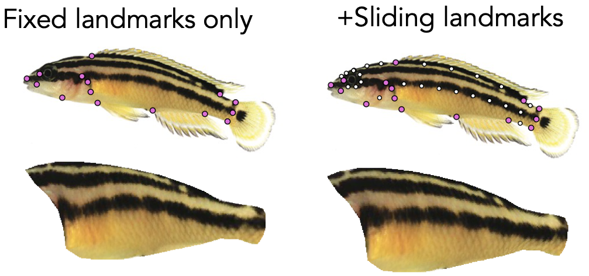
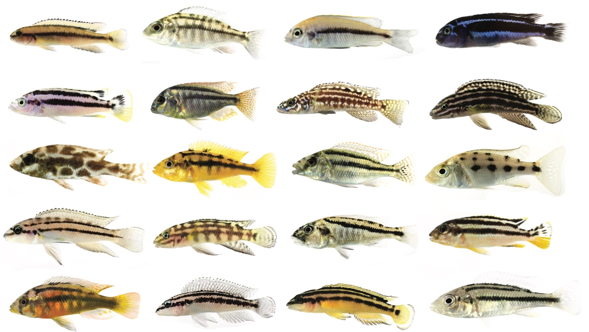
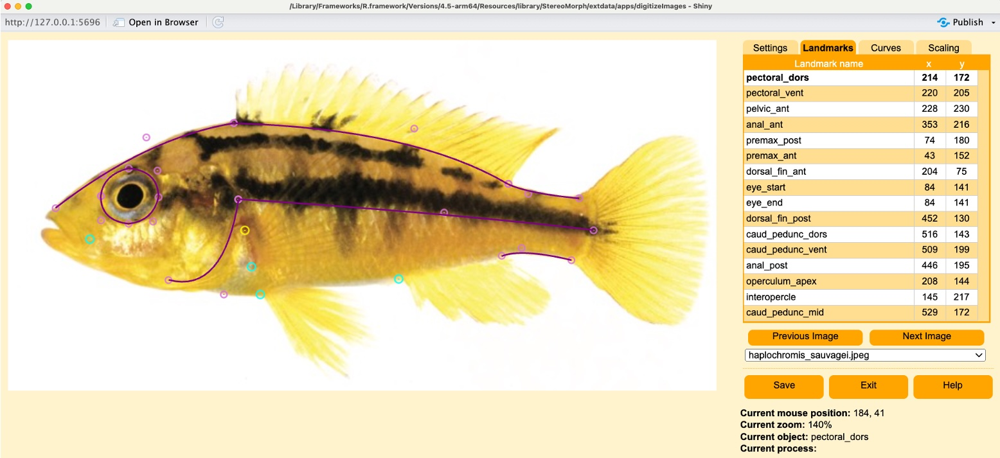
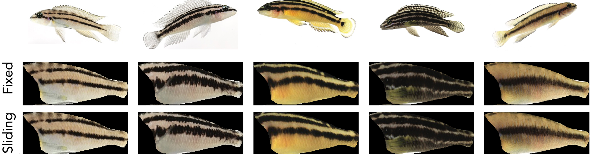
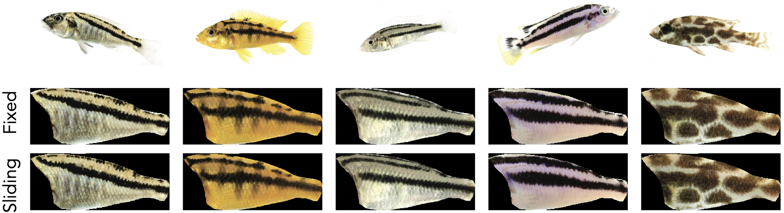
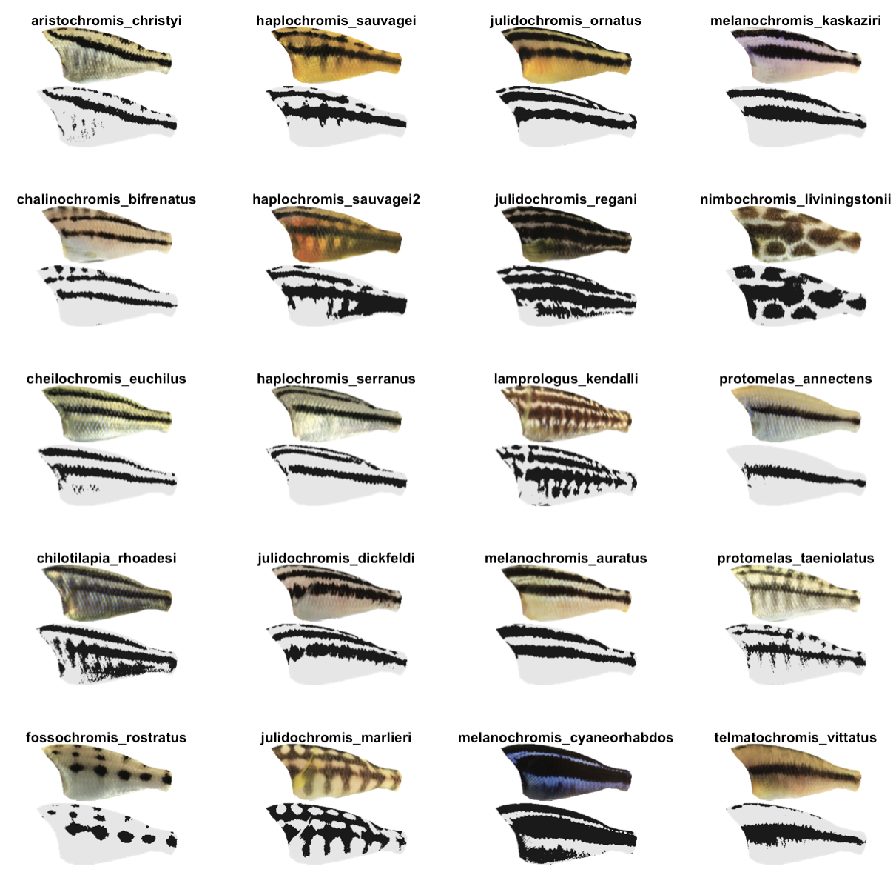
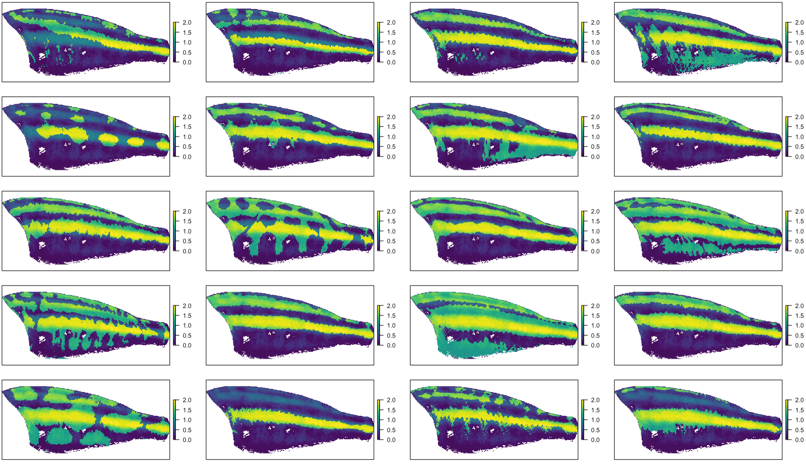
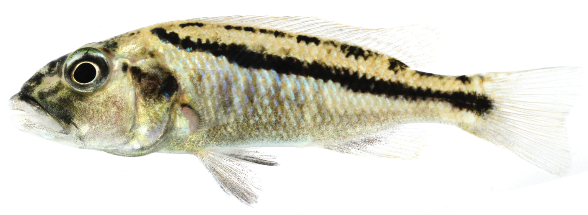
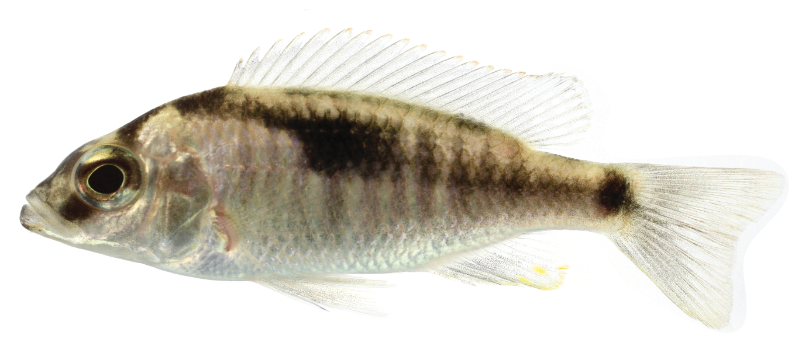

<small>All images in this tutorial were taken by [Prof. Claudius Kratochwil](https://scholar.google.com/citations?user=LzPw54QAAAAJ), used with permission.</small>

This tutorial will go over:

1.  How to generate and use semilandmarks to align images of organisms that don't have enough anatomical landmarks in the region of interest.
2.  How to use the [StereoMorph](https://github.com/aaronolsen/StereoMorph) package to landmark images for alignment, rather than ImageJ.

The previously posted [workflow](https://hiweller.rbind.io/post/recolorize-patternize-workflow/) for patternize/recolorize uses eight landmarks, all of which are fixed anatomical points. But many image datasets will include a greater range of shape variation that is not easily captured by fixed anatomical landmarks. For example, I usually work with images of fishes, which lack reliably identifiable landmarks in the middle of the flank (where much of the color pattern variation is). So sometimes when I use fixed landmarks, the results can be distorted, e.g. the stripe on the midline in this *Julidochromis ornatus* image:



As you can see on the right, [semilandmarks](https://doi.org/10.1016/S1361-8415(97)85012-8) can reduce these distortions. This technique is widespread in geometric morphometrics, where it is used to measure variation in biological shape. Here, I've borrowed the technique to *control* for variation in biological shape, so that we can analyze differences in pattern. This is pretty straightforward and can be done entirely in R with the help of the [StereoMorph](https://github.com/aaronolsen/StereoMorph) package (for landmarking and creating curves) and the [geomorph](https://github.com/geomorphR/geomorph) package (for converting curves into semilandmarks). After that, the downstream code is pretty much unchanged. Let's go!

## Example code and data

The example dataset is a set of images of 20 species of African cichlids, all taken by [Claudius Kratochwil](https://scholar.google.com/citations?user=LzPw54QAAAAJ) and used with his permission. As you can see, these species vary somewhat in their body shape, proportions, and posture:



All code demonstrated here can be found in the `07_sliding_landmarks` example folder in the examples repository: <https://github.com/hiweller/recolorize_examples>.

## Landmarking with StereoMorph

I prefer using StereoMorph to ImageJ for two reasons. First, the StereoMorph interface lets you fit Bezier curves to your images, which makes it much easier to generate semilandmarks. Second, StereoMorph makes batch processing less prone to user error. You specify the landmarks before launching the interface (so you don't miss one or go in the wrong order), and landmark files are named automatically.

To digitize with StereoMorph, first install and load the package per usual:


``` r
install.packages("StereoMorph") 
library(StereoMorph)
```

Next, specify the folder that contains the images to be digitized as well as the folder for saving landmark files. I like to include a line that then creates this folder if it does not already exist.


``` r
image_directory <- "07_sliding_landmarks/images/"
landmark_directory <- "07_sliding_landmarks/landmarks/"

if (!dir.exists(landmark_directory)) { dir.create(landmark_directory) }
```

> **Note!**
>
> StereoMorph can't handle periods, spaces or parentheses as characters in file names. The code will run, but your images won't load. Replace these characters in your filenames before you use the package.

Now define the landmarks and curves. You can do this in a spreadsheet, rather than in-line as I've done it here. But I like doing them in the script file itself, since it makes it easier for me to modify the landmarking scheme as-needed.

For StereoMorph, we specify two kinds of references: fixed landmarks and curves. Fixed landmarks are standard anatomical landmarks, provided as a vector of landmark names. Curves are specified as a 3-column matrix (curve name, curve start, curve end). Here you can see I specify five fixed landmarks and seven curves. There are no particular guidelines about how many landmarks/curves to use--I usually start with as many as I can reliably mark and eliminate them as needed. The midline curve is especially important, as it's what lets me compensate for differences in posture across fish images.


``` r
# define landmarks and curves:

# individual fixed landmarks not associated with a curve:
landmarks_ref <- c("pectoral_dors", "pectoral_vent", "pelvic_ant", "anal_ant", "premax_post")

# curves are defined in a 3-column matrix: curve name, curve start, curve end
curves_ref <- matrix(c("head", "premax_ant", "dorsal_fin_ant", # make a curve called 'head' which connects the premax to the start of the dorsal fin
                       "eye", "eye_start", "eye_end",
                       "dorsal", "dorsal_fin_ant", "dorsal_fin_post",
                       "caudal_dors", "dorsal_fin_post", "caud_pedunc_dors",
                       "caudal_vent", "caud_pedunc_vent", "anal_post",
                       "operculum", "operculum_apex", "interopercle",
                       "midline", "operculum_apex", "caud_pedunc_mid"),
                     ncol = 3, byrow = TRUE)
```

Then launch the actual digitizing application using the `digitizeImages` function. Change the colors and sizes of the different landmark types so they have good contrast with your images.


``` r
# opens the digitizing app:
digitizeImages(image.file = image_directory,
               shapes.file = landmark_directory, 
               landmarks.ref = landmarks_ref,
               curves.ref = curves_ref, landmark.color.blur = "cyan", landmark.color.focus = "yellow", 
               control.point.color.blur = "orchid", control.point.color.focus = "hotpink", 
               landmark.radius = 5)
```



Check out the [StereoMorph manual](https://aaronolsen.github.io/software/stereomorph/StereoMorph%20User%20Guide%20v1.6.1.pdf) for a walkthrough of how to use the app. I mostly use keyboard shortcuts:

-   `n` to advance to the next landmark
-   `p` to go to the previous landmarks
-   `x` to place or move a landmark
-   `d` to delete a landmark
-   arrow keys to adjust the landmark position (`Shift` + arrow keys to move by 10 pixels at a time)

Curves work the same way, but you're placing anchor points, so it's less intuitive at first (use the 'Curves' tab to see what you're doing). I really think the best way to learn that is to play around with it. Otherwise, read the manual.

Once finished, you'll have a folder full of text files with landmarks and curves, one per image. You can read these into R using the `readShapes` function, which we'll do next to extract the semilandmarks.

## Going from curves to semilandmarks

Load in the original landmarks using `readShapes`:


``` r
# load in original landmarks
stereomorph_landmarks <- StereoMorph::readShapes("07_sliding_landmarks/landmarks/")
names(stereomorph_landmarks)

# we have landmarks.pixel, curves.control, and curves.pixel:
names(stereomorph_landmarks)
```


```
## [1] "landmarks.pixel" "curves.control"  "curves.pixel"
```

### A quick intro to StereoMorph shapes objects

The `landmarks.pixel` element contains a three-dimensional array, where each 'slice' is an XY matrix of coordinates for one image:


``` r
dimnames(stereomorph_landmarks$landmarks.pixel)[[3]]
```

```
##  [1] "aristochromis_christyi"      "chalinochromis_bifrenatus"  
##  [3] "cheilochromis_euchilus"      "chilotilapia_rhoadesi"      
##  [5] "fossochromis_rostratus"      "haplochromis_sauvagei"      
##  [7] "haplochromis_sauvagei2"      "haplochromis_serranus"      
##  [9] "julidochromis_dickfeldi"     "julidochromis_marlieri"     
## [11] "julidochromis_ornatus"       "julidochromis_regani"       
## [13] "lamprologus_kendalli"        "melanochromis_auratus"      
## [15] "melanochromis_cyaneorhabdos" "melanochromis_kaskaziri"    
## [17] "nimbochromis_liviningstonii" "protomelas_annectens"       
## [19] "protomelas_taeniolatus"      "telmatochromis_vittatus"
```

``` r
print(stereomorph_landmarks$landmarks.pixel[ , , 1])
```

```
##                  [,1] [,2]
## pectoral_dors     147   91
## pectoral_vent     149  114
## pelvic_ant        147  131
## anal_ant          247  149
## premax_post        56   83
## premax_ant         24   50
## dorsal_fin_ant    162   25
## eye_start          61   43
## eye_end            61   43
## dorsal_fin_post   331  104
## caud_pedunc_dors  382  123
## caud_pedunc_vent  368  167
## anal_post         313  146
## operculum_apex    148   73
## interopercle       89  112
## caud_pedunc_mid   387  149
```

`curves.pixel` is a list with one element per image, where the shape of the curve is represented as a series of pixel coordinates. So to look at the first few coordinates for e.g. the dorsal fin curve for the first image:


``` r
head(stereomorph_landmarks$curves.pixel$aristochromis_christyi$dorsal)
```

```
##      [,1] [,2]
## [1,]  162   25
## [2,]  163   26
## [3,]  164   26
## [4,]  165   26
## [5,]  166   26
## [6,]  167   27
```

It's good to know what's in the file, but you won't need to modify this directly for the next step.

### Using geomorph to extract semilandmarks

Install the geomorph package if you don't have it already:


``` r
install.packages("geomorph")
```

The geomorph `readland.shapes` function is specifically meant for extracting coordinate data from a StereoMorph shapes object. All we have to specify is how many landmarks we want per curve and whether any of these curves are continuous. To create the vector of number of landmarks per curve, I find it helpful to list out the curves in my shapes object:


``` r
# curve names:
names(stereomorph_landmarks$curves.pixel[[1]])
```

```
## [1] "head"        "eye"         "dorsal"      "caudal_dors" "caudal_vent"
## [6] "operculum"   "midline"
```

Again, no hard and fast rule for how many landmarks to specify per curve. The general tradeoff is that too few landmarks = you won't get a better fit compared to fixed landmarks, too many = you might over-emphasize alignment of a particular region. I suspect there are also some costs to computation time for the thin-plate spline transformation, but I haven't measured that. Here, I specify a lot of landmarks on the midline because that area has no fixed landmarks to anchor it otherwise, and it tends to get the most distorted for my images.


``` r
# define how many semilandmarks we want per curve:
ncurvepts <- c(6, # head
               8, # eye
               6, # dorsal
               3, # caudal_dors
               3, # caudal_vent
               3, # operculum
               10) # midline
```

Then use the `readland.shapes` function. Notice that I also specify that the eye (curve #2) is a continuous curve, e.g. that there is no significance to the start/end point for that curve.


``` r
# then we can use geomorph just to automatically extract the semilandmarks:
geomorph_landmarks <- geomorph::readland.shapes(stereomorph_landmarks, 
                                                # eye is a continuous curve:
                                                continuous.curve = 2, 
                                               nCurvePts = ncurvepts)
```

```
## Warning in GMfromShapes0(Shapes, scaled = scaled): No specimens have scaling.  Unscaled landmarks imported, as a result
```

``` r
landmark_list_sliding <- geomorph_landmarks$landmarks

# new landmarks are all labeled with 'curveLM'
landmark_list_sliding$aristochromis_christyi
```

```
##                       [,1]      [,2]
## pectoral_dors    147.00000  91.00000
## pectoral_vent    149.00000 114.00000
## pelvic_ant       147.00000 131.00000
## anal_ant         247.00000 149.00000
## premax_post       56.00000  83.00000
## premax_ant        24.00000  50.00000
## dorsal_fin_ant   162.00000  25.00000
## eye_start         61.00000  43.00000
## eye_end           61.00000  43.00000
## dorsal_fin_post  331.00000 104.00000
## caud_pedunc_dors 382.00000 123.00000
## caud_pedunc_vent 368.00000 167.00000
## anal_post        313.00000 146.00000
## operculum_apex   148.00000  73.00000
## interopercle      89.00000 112.00000
## caud_pedunc_mid  387.00000 149.00000
## curveLM.17        46.93482  36.00000
## curveLM.18        73.94071  29.00000
## curveLM.19       102.60345  26.00000
## curveLM.20       132.09462  25.00000
## curveLM.21        71.67121  30.32879
## curveLM.22        87.97846  30.97846
## curveLM.23        99.11414  41.11414
## curveLM.24        96.00000  56.18173
## curveLM.25        81.62640  63.00000
## curveLM.26        66.02031  58.00000
## curveLM.27       197.67868  37.67868
## curveLM.28       233.67696  51.00000
## curveLM.29       268.98579  65.98579
## curveLM.30       301.37157  82.37157
## curveLM.31       355.63604 117.00000
## curveLM.32       342.65685 152.00000
## curveLM.33       128.37868 108.62132
## curveLM.34       175.73965  80.00000
## curveLM.35       202.47930  88.00000
## curveLM.36       228.74061  95.74061
## curveLM.37       255.55651 103.55651
## curveLM.38       282.11247 112.00000
## curveLM.39       308.85212 120.00000
## curveLM.40       335.53976 129.53976
## curveLM.41       361.08878 139.00000
```

We get a warning here about scaling, because the input curves are just in pixels, not real-world units like millimeters. That doesn't matter here since we're using these coordinates the align the images, not measure e.g. centroid size, so it can be safely ignored (and you can avoid this warning by specifying `scaled = FALSE`).

Last, get rid of the duplicate eye landmark. In the original digitization scheme, you can see that I make a continuous curve around the eye by having the start and the end of the curve be in the same place. But having the same point twice actually interferes with the alignment downstream (you end up with all-black images), so it's easier to just remove it here.

> *Note!*
> Skip this step if you don't have any continuous curves (like an eye).


``` r
# get rid of the duplicate eye landmark (otherwise this causes problems later)
# 1. if you're also using a continuous curve, change "eye_end" to the name of one of landmark_list_sliding$aristochromis_christyi[8:9, ]

#    the landmarks anchoring your continuous curve
# 2. IF YOU ARE NOT USING A CONTINUOUS CURVE YOU DON'T HAVE TO DO THIS PART AT ALL
eye_idx <- grep("eye_end", rownames(landmark_list_sliding[[1]]))
landmark_list_sliding <- lapply(landmark_list_sliding, \(x) x[-eye_idx, ])
```

At this point, you can save the landmarks as individual text files or just save the `landmark_list_sliding` object as a .RDS file. Alternatively, you can just run the patternize alignment with this object, as it's already in the right format.

## Running patternize

This step is the same as usual, with the exception that we're using an object already in the R environment as the landmark list.


``` r
library(patternize)

# since the landmark list names come from the filenames, we can use these as IDs
id_list <- names(landmark_list_sliding)

# make image list
image_list <- makeList(IDlist = id_list, 
                       type = "image", 
                       prepath = "07_sliding_landmarks/images/", 
                       extension = ".jpeg")

# make mask
# there is also a version of this mask that includes the head
mask <- read.table("07_sliding_landmarks/haplochromis_sauvagei_mask.txt")

# and run alignment
alignedImages <- patternize::alignLan(image_list, 
                                      landmark_list_sliding,
                                      id_list,
                                      adjustCoords = FALSE,
                                      res = c(600, 260),
                                      resampleFactor = 1,
                                      transformRef = landmark_list_sliding[['haplochromis_sauvagei']], 
                                      maskOutline = mask,
                                      cartoonID = 'haplochromis_sauvagei',
                                      plotTransformed = TRUE)

# flip the images to be right-side up:
alignedImages <- lapply(alignedImages, raster::flip)

# and save:
saveRDS(alignedImages, 
        file = paste0("07_sliding_landmarks/rds_files/aligned_sliding_no_head.rds"))
```

In this case, I'm using a mask that crops out the fins and head in order to focus on the flank of the fish. So arguably, I could have left out all the head landmarks, and in fact in later versions of this scheme I dropped those landmarks entirely. But one of the reasons I incorporated StereoMorph into my workflow was to make it easier to add and drop landmarks and rerun my alignments to see how e.g. including five versus ten semilandmarks would affect my results, since all I have to do is edit the `landmark_list_sliding` object without having to rewrite files.

## Alignment results

On GitHub, I also [include a version of this step](https://github.com/hiweller/recolorize_examples/blob/main/07_sliding_landmarks/01b_alignment_fixed_landmarks.R) where we extract only the fixed landmarks from the shapes file and run the alignment for comparison. So how do these two versions compare? We can see that for some fish, especially longer-bodied species, the sliding landmarks reduce distortion on the flank:



In general, the midlateral stripe goes from being quite bent to being more or less straight, as it appears on the original images. Just as importantly, we can see that in fish that had more neutral body positions and proportions more similar to the fish used for the mask, the semilandmarks have had next to no effect:



There are certainly limits to what semilandmarks can do by stretching an image (I probably wouldn't use them to uncurl a coiled snake or warp an image of an eel to the outline of a pufferfish). That said, I haven't spent much time quantifying this or exploring the use of semilandmarks with the same degree of thoroughness with which they've been tested in geometric morphometrics, which might be worth doing to provide more concrete recommendations and limits about how to incorporate this technique. For now, I think it's a good way to account for minor differences in body posture or proportion.

## Segmentation with recolorize

This is more or less the same as other examples, with the exception that I use k-means clustering. That's because I've found it to work quite reliably for dark-light differences (e.g. segmenting into two colors) with minimum fuss; I just add a step to ensure that the colors are always in the same order. My basis for the clusters here is that I'm separating melanic vs. non-melanic aspects of the color pattern.


``` r
# libraries
library(patternize)
library(recolorize)

# read in aligned images
aligned_images <- readRDS("07_sliding_landmarks/rds_files/aligned_sliding_no_head.rds")

# create an empty vector
rc_list <- vector("list", length(aligned_images))
names(rc_list) <- names(aligned_images)

# make centers for visualizing
centers <- rbind(rep(0.1, 3), rep(0.9, 3))

# segmentation code
# in this case - just use kmeans
for (i in 1:length(aligned_images)) {
  
  # convert image
  im <- brick_to_array(aligned_images[[i]])
  
  # I found k-means clustering in CIELAB space to work fine
  rc_obj <- recolorize(im, method = "k", n = 2, 
                       color_space = "Lab",
                       plotting = F)
   
  # darkest color first (k-means = colors are random order every time otherwise)
  rc_obj <- reorder_colors(rc_obj, order(rowMeans(rc_obj$centers)))
  rc_obj$centers <- centers

  # save 
  rc_list[[i]] <- rc_obj
  
  # uncomment to plot:
  # plot(rc_obj) 
}
```

You can see that the resulting segmentations look overall quite reasonable, and they're more than sufficient for my tutorial purposes:



## Visualizing pattern overlap

Rather than a pattern PCA to summarize pattern variation, we'll make a heatmap to identify the most conserved or variable parts of the pattern. Why a heatmap for this dataset? The presence or absence of cichlid stripes appears to be [controlled by a single gene](https://www.science.org/doi/full/10.1126/science.aao6809) (*agrp2*), and may be initialized along conserved neural crest cell migratory pathways (pigment cells are largely neural-crest-derived). We might therefore expect that cichlid stripes are in a conserved anatomical location, and it's interesting to ask how true this is across different species.

Making the heatmap is pretty easy:


``` r
# libraries
library(patternize)
library(raster)

# read in and convert recolorize list
rc_list <- readRDS("07_sliding_landmarks/rds_files/kmeans_segmented.rds")

pat_list <- lapply(rc_list, recolorize::recolorize_to_patternize)
names(pat_list) <- names(rc_list)

# heatmap ####
x <- sumRaster(pat_list, names(pat_list), type = 'k')

# fish colors:
plot(x[[1]], asp = 2/5, col = c("white", colorRampPalette(c("beige", "black"))(100)))
# we can see that the stripe locations are quite conserved!

# more traditional palette:
plot(x[[1]], asp = 2/5, col = c("white", viridisLite::viridis(100, direction = -1)))
```

}}index.en_files/figure-html/unnamed-chunk-17-1.png" width="672" />}}index.en_files/figure-html/unnamed-chunk-17-2.png" width="672" />

The values for the color palette range from 0 to 20, because we have 20 images in the dataset (so if every binary map has a '1' in the same location, those sum to 20). We can see that overall, the midlateral stripe is quite conserved across all of these species, although note that this visualization does not account for similarity due to phylogenetic relatedness. (Could be fun to incorporate though.)

We can get a better picture of how each of these species matches up with the 'template' above by stacking the segmentations on top of the average. With this color scheme, bright yellow regions are dark both on average and in the individual fish:


``` r
# we can compare individual patterns to the composite:
mean_rast <- x[[1]] / length(pat_list)
layout(matrix(1:20, nrow = 5)); par(mar = rep(1, 4))
for (i in 1:length(pat_list)) {
  test <- ((pat_list[[i]][[1]] + mean_rast))
  plot(test, asp = 2/5,
       col = c("white", viridisLite::viridis(100, direction = 1, )), 
       axes = F)
}
```



If you've got evo-devo brain, I'll point out something interesting that pops out of this visualization, in addition to the indication that stripe positioning is highly conserved. The image on the top left, of *Aristochromis christyi*, doesn't seem to match the template. It has a stripe, but it's diagonal:



We actually think that stripes like this might form by connecting two stripes with relatively anatomically fixed positions, something you can see a bit more clearly on e.g. *Naevochromis chrysogaster*:



## Conclusion

This tutorial shows why and how to use sliding semilandmarks for alignment. Especially in cases where body shape or position is more variable (e.g. live specimens, clade-level diversity), this can be the difference between detecting signal or noise in a color pattern analysis. I also highly recommend the use of StereoMorph and geomorph to generate your landmarks, regardless of whether you choose to use curves and semilandmarks, since this makes it much easier to change your digitization scheme both flexibly and reliably. Please get in touch if you have any questions or suggestions for improvement.
